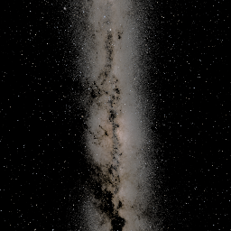
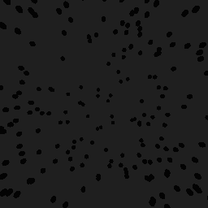

# Pre-stimulus, stimulus and post-stimulus

The active `sequenceConfig.json` selects `Examples/Flight/selwyn-stars-left-swarm.example.json` in **Choice_Selwyn**. Start it from Control. One cycle is **240 seconds of stars and terrain, then 240 seconds of gray sky and a leftward Bogong swarm**. The cycle repeats in the same scene. The existing `Kannadi/` recipes and hardware configuration are unchanged.

## One experimental file

An experiment can contain three phase objects. Each enabled object contains the full configuration normally used by that scene, plus `enabled` and `durationSeconds`. No extra files or sequence-level phase settings are needed. For example, this is a complete minimal Choice experiment:

```json
{
  "preStimulus": {
    "enabled": true,
    "durationSeconds": 240,
    "resetPositionOnStart": true,
    "resetRotationOnStart": true,
    "randomInitialRotation": true,
    "closedLoopOrientation": true,
    "objects": [],
    "headingReference": {
      "enabled": true,
      "startOffsetSeconds": 0,
      "windowSeconds": 240
    }
  },
  "stimulus": {
    "enabled": true,
    "durationSeconds": 240,
    "resetPositionOnStart": false,
    "resetRotationOnStart": false,
    "closedLoopOrientation": true,
    "objects": []
  },
  "postStimulus": { "enabled": false }
}
```

Use the [complete canonical template](../Assets/StreamingAssets/Templates/experiment.template.json) for every Choice setting, or the [complete active recipe](../Assets/StreamingAssets/Examples/Flight/selwyn-stars-left-swarm.example.json) for the sky, movement and swarm details omitted from the minimal example.

- **Old flat JSON remains supported**, with its existing scene schema and sequence timer. No phase keys means one stimulus. Existing fields do not need to move.
- `preStimulus` and `postStimulus` default off. Omit them, use `null`, `{}`, or `{ "enabled": false }`. Disabled phase contents have no effect.
- `stimulus` defaults enabled. A phased file requires an enabled stimulus with a positive finite `durationSeconds`.
- Each phase is a complete scene configuration, not a patch inherited from the previous phase. Repeat closed-loop, autopilot, sky and other settings you intend to retain. Omitted fields use that controller's existing defaults.
- The nested durations own the phased experiment's schedule. Keep outer sequence `duration` equal to their total for readability; the active sequence says `480`. An observation overrun extends that total. Flat files still use sequence `duration` as before.
- Phases change conditions inside the current scene. `reloadScene: false` additionally keeps the same scene when the outer sequence repeats. Set outer `loop: true` to repeat the cycle.
- Choice, Swarm, Kannadi, Optomotor and Dynamic Choice accept phase payloads. Dynamic Choice retains its design schema (`steps`, `intertrial`, etc.) inside each phase and still uses `parameters.design`. Its inner trials/triggers restart when entering a new phase.
- Mixing flat experiment settings with phase objects is rejected, avoiding silently ignored settings. Phase durations must be explicit; invalid settings appear in the status/error panel.

## Independent pose resets

`resetPositionOnStart` and `resetRotationOnStart` both default **true**. They control the application of `initialPosition` and `initialRotation` at phase/experiment start. Random initial yaw applies when `randomInitialRotation: true` and rotation reset is enabled. Turning both resets off preserves the live transform **and tracking integration**.

| Position reset | Rotation reset | Effect |
|---|---|---|
| true | true | Start at the configured pose, using random yaw if requested. |
| true | false | Reset position while retaining current heading. |
| false | true | Keep position and apply initial/random heading. |
| false | false | Continue current position and heading. |

Choice uses its root initial pose. Swarm/Kannadi use their existing per-rig `vrConfigs` initial poses; the reset switches and random-yaw option are at the experiment root. Optomotor has optional root initial poses; omission preserves its historical pose behavior. Dynamic Choice uses the reset switches alongside initial pose in each design step/intertrial. The operator's **R** shortcut continues to work independently.

For the active recipe, every cycle starts pre-stimulus at its configured initial position with random yaw. The transition **from pre-stimulus to stimulus** resets neither position nor rotation. Autopilot remains 7 world units/s, yaw remains closed loop, and AGL remains 100 throughout.

## Heading measurement and application are separate

Place `headingReference` inside **preStimulus**. `enabled` defaults false, `windowSeconds` defaults 180 and `startOffsetSeconds` defaults zero. Disabled reference parameters have no effect. Enabled windows must be positive and finite; enabled offsets must be nonnegative and finite.

Measurement begins `startOffsetSeconds` after the pre-stimulus world has been configured. It takes one current virtual yaw sample per rendered frame during the following `windowSeconds`. Tracking, terrain, sky, configured objects and autopilot all continue. If offset + window exceeds pre-stimulus duration, pre-stimulus continues until measurement completes. If it ends earlier, the result freezes while the rest of pre-stimulus continues. Samples from earlier cycles or the offset period are excluded.

Each rig independently computes `atan2(mean(sin(yaw)), mean(cos(yaw)))` and resultant length `r`. All headings count, including stationary headings and circling animals. There is no stability threshold and no resampling across stalled frames. This is a circular mean of virtual orientation, not velocity bearing or raw Kinefly wing input.

Every supported spawn configuration must explicitly select **`useHeadingReference: true`** to use that zero:

| Spawner | Flag location | Referenced quantities |
|---|---|---|
| Choice regular objects / bands | Each `objects[]` entry | Position offsets and yaw; band direction and boundary rotation. |
| Swarm | Experiment/phase root | `mu`, spawn-center offset and spawn volume orientation. |
| Embedded Choice swarm | `swarm.useHeadingReference` | Same Swarm quantities. |
| Kannadi | Experiment/phase root | Hex-grid offsets; mirrored animal rotations still follow the tracked animal. |
| Dynamic Choice | Each step's `objects[]` entry | Position offset and spawned object yaw. |

Every flag defaults **false**, even when a heading was measured. An unavailable reference leaves authored directions and positions unchanged. With an available, opted-in reference, positions become offsets from the rig at onset; the rig itself is not rotated. Swarm also offers `spawnRelativeToAnimal` for relative placement independent of heading measurement. World directions remain frozen after spawning. Zero aligns with the mean, +90° is right/clockwise, and **−90° is left**. Choice bands retain their historical angle convention when opted out.

The old flat `headingReference` form remains readable: its observation precedes the sequence presentation timer, but the configured world is now visible during measurement. Explicitly opted-in spawners reapply the completed reference. Use phased files when pre-stimulus should have different conditions. Reset switches govern continuity explicitly; measurement no longer implicitly disables pose resets.

## Selwyn stars → gray sky and leftward swarm

The active file specifies:

- **Pre-stimulus:** 240 s, live Selwyn night-sky sample, terrain, no conspecifics, random initial yaw; measurement from offset 0 for 240 s.
- **Stimulus:** 240 s, the same terrain and continuous pose, uniform RGB `(0.12, 0.12, 0.12)` sky; 256 dark Bogong dots per rig, RGB `(0.01, 0.01, 0.01)`, constant **2° diameter**, no blinking, fixed heading `mean − 90°`, speed 2 world units/s.
- **Dorsal placement:** a 120 × 40 × 120 volume centered 50 units above each rig, so dots start 30–70 units above it. Periodic boundaries follow rig **position**, preserving the overhead population during flight; they do not follow its turns. Dots move in their fixed world direction and wrap at the volume edges.
- **Post-stimulus:** disabled. Outer sequence repeats the 480 s cycle without scene reload.

The chosen gray is a specified uniform value, **not a measured average of the rendered star panorama**. Set `uniformSkyColor` to an RGBA object to select another color, or `null` to disable it. It takes precedence over `skyboxPath` and `nightSky`. Unity creates and archives the uniform image; no image file needs to be supplied. A 2° dot subtends approximately 1.12 pixels at the center of a 64-pixel, 90° face, or 2.23 pixels at 128 pixels; actual raster coverage varies with position.

The sky remains **static between 30-minute image updates**; there is no continuous rotation/interpolation between bakes. A new cycle with `localTime: "now"` samples the current instant when the starry phase begins.

## Records and monitoring

`heading_reference.jsonl` records each frozen mean, resultant, sample count and observation timestamps. For compatibility the completion fields remain named `presentedAt` / `presentedUtc`; these refer to **measurement completion**, which can precede stimulus onset. `experiment_phases.jsonl` records actual phase onsets, effective durations, trial/step, sky ID and each rig's frozen reference. Sky images/colors and usage remain in `Skyboxes/`.

Outbound telemetry retains topic `matrex.telemetry.v1` and the six-component pose, input, gain/DC and error fields. `system.phase` reports `preStimulus`, `stimulus` or `postStimulus` for phased files (flat observations retain `assessment`); `remainingPhaseSeconds` gives the current phase countdown and `remainingStepSeconds` includes all remaining phases. The bottom-right panel shows both. **Tab** restores or hides the panel; a new error reopens it.

Other complete examples: [offset + overrun + recovery](../Assets/StreamingAssets/Examples/Swarm/phased-offset-recovery.example.json), [static → moving → static optomotor](../Assets/StreamingAssets/Examples/Optomotor/phased-static-motion-static.example.json).

Validation: `ExperimentPhaseValidation.Run` exercises a shortened real Selwyn cycle with offset, overrun, enabled post and repeat. `RunFull` executes the actual 240 + 240 second recipe through the next cycle. `PhaseAdapterValidation.Run` also exercises nested pre/stimulus/post payloads in Swarm, Kannadi, Optomotor and Dynamic Choice. The Selwyn checks validate rendering, per-rig references, opt-in, retained scene/rig/terrain, continued motion, fixed stimulus heading, cleanup, telemetry and phase logs in a disposable Unity project. Hardware and display photometry remain bench measurements.

Rendered dorsal camera checks (256 × 256 capture; angular sizes are preserved at the configured panel resolution):





The [saved validation report](experiment-phase-validation-results.json) includes the full-duration run, final-source regressions and a standalone macOS build. The standalone smoke run received 452 ZMQ snapshots across four shortened cycles with four synthetic Kinefly publishers, four continuous pose transitions and no runtime errors.
